# FlowFinance — Schema Completo PostgreSQL / Supabase

> **Versión:** 1.1 (aprobada — 2026-06-30)
> **Cobertura:** 20 módulos · 48 tablas + 1 vista · RLS habilitado en todas
> **Verificado en Supabase real:** 2026-07-XX — proyecto `nfqdlsmiyriuuqlrvjuy` (FinanzasPersonal)
> **País de lanzamiento:** El Salvador 🇸🇻 (USD como moneda oficial)
> **Objetivo:** diseñar el schema completo de UNA vez para evitar migraciones destructivas con datos reales en producción.

---

## Decisiones aprobadas (2026-06-30)

**Decisiones de diseño:**
1. ✅ Schema completo desde Fase 0 — todas las tablas
2. ✅ Multi-moneda con **USD** como base predeterminada
3. ✅ `numeric(15,2)` dinero · `numeric(20,8)` cripto
4. ✅ Soft delete en tablas críticas (transactions, income_entries, goals, family_loans, loan_portfolio); resto hard delete + audit_log
5. ✅ `transactions` tabla universal con `kind` enum
6. ✅ `income_entries` + `transactions` vinculados (dualidad fiscal/flujo)
7. ✅ Categorías sistema + custom adaptadas para **El Salvador**
8. ✅ Generated columns para campos derivados (recomendado, atomicidad garantizada)
9. ✅ Colaborativo cableado en transactions, budgets, goals, trips
10. ✅ FINN: conversations + messages + insights separados con tracking de tokens/costo
11. ✅ `pg_cron` para jobs (sin Celery en MVP)

**Resoluciones de 8 preguntas:**
1. ✅ Colaborativo amplio: budgets + goals + trips compartibles
2. ✅ Usuario puede eliminar categorías sistema → tabla `user_hidden_categories`
3. ✅ Money class override **por transacción** (campo `money_class_override`)
4. ✅ Splits modelados como transacciones hijas con `split_parent_id`
5. ✅ Dualidad `income_entries` ↔ `transactions` confirmada
6. ✅ `amount_base` llenado vía trigger (no generated column; FX externa)
7. ✅ Factura electrónica solo adjunto manual — sin parser CFDI/DTE
8. ✅ `audit_log` solo registra deletes y exports (no UPDATEs de transactions)

---

## Cambios v1.0 → v1.1

| Campo / aspecto | v1.0 (MX) | v1.1 (SV) |
|---|---|---|
| `users.country` default | `MX` | `SV` |
| `users.language` default | `es-MX` | `es-SV` |
| `users.currency_default` default | `MXN` | `USD` |
| `users.timezone` default | `America/Mexico_City` | `America/El_Salvador` |
| `users.rfc_regime` | RFC + régimen MX | `tax_regime` genérico |
| Toda tabla con moneda | `default 'MXN'` | `default 'USD'` |
| `tax_records` campos CFDI | `rfc_emisor`, `cfdi_uuid` | `issuer_tax_id`, `invoice_uuid` (genéricos) |
| Categorías seed | Catálogo MX | Catálogo SV |
| Nueva tabla | — | `user_hidden_categories` |

---

## Tabla de contenido

1. [Convenciones generales](#1-convenciones-generales)
2. [Tipos custom y ENUMs](#2-tipos-custom-y-enums)
3. [Funciones y triggers compartidos](#3-funciones-y-triggers-compartidos)
4. [Diagrama ER (alto nivel)](#4-diagrama-er-alto-nivel)
5. [Dominio 1 — Usuarios, settings y dispositivos](#dominio-1--usuarios-settings-y-dispositivos)
6. [Dominio 2 — Catálogos compartidos (currencies, fx_rates, categories)](#dominio-2--catálogos-compartidos)
7. [Dominio 3 — Cuentas y transacciones](#dominio-3--cuentas-y-transacciones)
8. [Dominio 4 — Ingresos](#dominio-4--ingresos)
9. [Dominio 5 — Presupuesto](#dominio-5--presupuesto)
10. [Dominio 6 — Tarjetas de crédito](#dominio-6--tarjetas-de-crédito)
11. [Dominio 7 — Deudas propias](#dominio-7--deudas-propias)
12. [Dominio 8 — Metas y suscripciones recurrentes](#dominio-8--metas-y-suscripciones-recurrentes)
13. [Dominio 9 — Inversiones y patrimonio neto](#dominio-9--inversiones-y-patrimonio-neto)
14. [Dominio 10 — Préstamos familiares (MOD-13)](#dominio-10--préstamos-familiares-mod-13)
15. [Dominio 11 — Cartera con interés (MOD-14)](#dominio-11--cartera-con-interés-mod-14)
16. [Dominio 12 — Viajes (MOD-18)](#dominio-12--viajes-mod-18)
17. [Dominio 13 — Fiscal (MOD-19)](#dominio-13--fiscal-mod-19)
18. [Dominio 14 — FINN / IA](#dominio-14--finn--ia)
19. [Dominio 15 — Simulador de impacto](#dominio-15--simulador-de-impacto)
20. [Dominio 16 — FlowScore y gamificación](#dominio-16--flowscore-y-gamificación)
21. [Dominio 17 — Finanzas colaborativas (MOD-11)](#dominio-17--finanzas-colaborativas-mod-11)
22. [Dominio 18 — Alertas y notificaciones](#dominio-18--alertas-y-notificaciones)
23. [Dominio 19 — Billing / Stripe](#dominio-19--billing--stripe)
24. [Dominio 20 — Auditoría](#dominio-20--auditoría)
25. [Resumen de RLS por tabla](#25-resumen-de-rls-por-tabla)
26. [Orden de migraciones por fase](#26-orden-de-migraciones-por-fase)

---

## 1. Convenciones generales

### 1.1 Tipos de datos
| Categoría | Tipo PostgreSQL | Notas |
|---|---|---|
| Identificadores | `uuid` con `gen_random_uuid()` | Nunca `serial`/`bigint` para PK |
| Dinero | `numeric(15,2)` | NUNCA `float`/`real` |
| Tipo de cambio FX | `numeric(15,6)` | 6 decimales para precisión |
| Porcentajes | `numeric(7,4)` | Ej: 18.5000% = `18.5000` |
| Fechas con hora | `timestamptz` | Siempre con timezone |
| Solo fecha | `date` | Cuando no hay hora |
| Moneda | `char(3)` | ISO 4217 (`MXN`, `USD`, `EUR`...) |
| Texto corto | `text` | No usar `varchar(n)` — sin beneficio |
| Datos flexibles | `jsonb` | Indexable con GIN |
| Booleanos | `boolean` | Con default explícito |

### 1.2 Columnas estándar en cada tabla

```sql
id          uuid primary key default gen_random_uuid(),
user_id     uuid not null references auth.users(id) on delete cascade,
created_at  timestamptz not null default now(),
updated_at  timestamptz not null default now()
```

Excepciones: tablas colaborativas usan `space_id` (con membership) en lugar de `user_id` directo. Catálogos compartidos no tienen `user_id`.

### 1.3 Naming
- Tablas: **plural** snake_case (`transactions`, `credit_cards`)
- Columnas: snake_case
- FKs: `<tabla_singular>_id` (`account_id`, `category_id`)
- ENUMs: snake_case singular (`account_type`, `transaction_kind`)
- Índices: `idx_<tabla>_<columnas>`
- Constraints: `chk_<tabla>_<regla>` / `uq_<tabla>_<columnas>`

### 1.4 Seguridad por defecto
- **RLS activado en TODA tabla con `user_id`** sin excepción
- Pattern owner: `auth.uid() = user_id`
- Pattern colaborativo: `is_collab_member(space_id)`
- Catálogos compartidos (`currencies`, `fx_rates`, `system_categories`): `select` público autenticado, `insert/update/delete` solo via service_role
- `service_role` solo se usa desde Edge Functions, NUNCA expuesto al cliente

### 1.5 Multi-moneda
Toda tabla con monto incluye:
```sql
amount               numeric(15,2) not null,
currency             char(3) not null default 'USD',
amount_base          numeric(15,2),     -- convertido a moneda base del usuario
fx_rate              numeric(15,6),     -- tasa al momento del movimiento
fx_rate_date         date,
```

Si `currency = users.currency_default` → `amount_base = amount`, `fx_rate = 1`, `fx_rate_date = transaction_date`.

### 1.6 Borrado
- **Hard delete por defecto** + registro en `audit_log`
- **Soft delete** (`deleted_at timestamptz`) solo en: `transactions`, `income_entries`, `goals`, `family_loans`, `loan_portfolio` (datos que el usuario puede recuperar de la papelera)
- Papelera con retención de 30 días, luego purga via `pg_cron`

### 1.7 Concurrencia y consistencia
- Todas las mutaciones con `updated_at` se actualizan vía trigger `set_updated_at()`
- Operaciones multi-tabla → siempre en función PL/pgSQL o Edge Function con transacción
- Versionado optimista (`version int`) solo en tablas con alta concurrencia (`accounts`, `budgets`)

---

## 2. Tipos custom y ENUMs

```sql
-- Plan de suscripción
create type plan_tier as enum ('free', 'starter', 'pro', 'elite');

-- Tipo de cuenta financiera
create type account_type as enum (
  'checking',          -- débito / corriente
  'savings',           -- ahorro
  'cash',              -- efectivo
  'credit_card',       -- tarjeta de crédito
  'investment',        -- cuenta de inversión / brokerage
  'digital_wallet',    -- Mercado Pago, PayPal, etc.
  'fx',                -- cuenta en divisas
  'virtual'            -- bolsillos virtuales / sub-cuentas
);

-- Estado de cuenta
create type account_status as enum ('active', 'closed', 'archived');

-- Tipo de transacción
create type transaction_kind as enum (
  'expense',           -- gasto
  'income',            -- ingreso (referencia rápida; el detalle vive en income_entries)
  'transfer_out',      -- salida por transferencia entre cuentas propias
  'transfer_in',       -- entrada por transferencia entre cuentas propias
  'cc_payment',        -- pago de tarjeta (cuenta origen → CC)
  'cc_charge',         -- cargo a tarjeta de crédito
  'fee',               -- comisión bancaria
  'interest_earned',   -- interés ganado en cuenta de ahorro
  'interest_paid',     -- interés pagado (tarjeta, deuda)
  'refund',            -- reembolso
  'adjustment'         -- ajuste manual de saldo
);

-- Estado de transacción
create type transaction_status as enum ('pending', 'cleared', 'reconciled', 'void');

-- Origen de captura
create type capture_source as enum (
  'manual',            -- entrada manual
  'csv_import',        -- importación CSV bancario
  'ocr_receipt',       -- foto de recibo via Gemini
  'voice',             -- dictado de voz (Fase 2)
  'open_banking',      -- Belvo (Fase 2)
  'recurring',         -- generado por regla recurrente
  'finn'               -- creado por FINN en conversación
);

-- Clasificación 50/30/20
create type money_class as enum ('need', 'want', 'savings_debt');

-- Tipo de ingreso
create type income_type as enum (
  'salary',            -- nómina
  'freelance',         -- proyectos/freelance
  'rental',            -- renta inmuebles
  'investment_yield',  -- rendimientos/dividendos
  'loan_payment',      -- abonos préstamos otorgados
  'business',          -- negocio propio
  'eventual',          -- venta activos, herencias, premios
  'other'
);

-- Modo de presupuesto
create type budget_mode as enum ('zero_based', 'flexible', '50_30_20');

-- Estado de presupuesto por categoría
create type budget_status as enum ('on_track', 'warning', 'over');

-- Recurrencia
create type recurrence_freq as enum (
  'daily', 'weekly', 'biweekly', 'monthly',
  'bimonthly', 'quarterly', 'semiannual', 'annual'
);

-- Tipo de meta financiera
create type goal_type as enum (
  'emergency_fund',
  'savings',
  'debt_payoff',
  'purchase',
  'travel',
  'education',
  'retirement',
  'other'
);

-- Estado de meta
create type goal_status as enum ('active', 'paused', 'completed', 'abandoned');

-- Tipo de inversión
create type investment_type as enum (
  'stock', 'etf', 'mutual_fund', 'bond', 'cete',
  'crypto', 'real_estate', 'business_equity', 'other'
);

-- Estado de préstamo
create type loan_status as enum ('active', 'paid', 'defaulted', 'restructured', 'written_off');

-- Método de pago de préstamo familiar
create type family_payment_method as enum (
  'cash', 'transfer', 'in_kind', 'service', 'mixed'
);

-- Estrategia de pago de deuda
create type debt_strategy as enum ('snowball', 'avalanche', 'custom');

-- Tipo de activo / pasivo manual (patrimonio)
create type asset_type as enum ('cash', 'investment', 'real_estate', 'vehicle', 'collectible', 'crypto', 'other');
create type liability_type as enum ('credit_card', 'personal_loan', 'mortgage', 'auto_loan', 'student_loan', 'other');

-- Categoría de viaje
create type trip_status as enum ('planning', 'active', 'completed', 'cancelled');
create type trip_expense_category as enum (
  'transport', 'lodging', 'food', 'activities',
  'shopping', 'fees', 'insurance', 'other'
);

-- Fiscal MX
create type tax_record_type as enum (
  'income_declaration',     -- ingresos declarables
  'deductible_expense',     -- gastos deducibles
  'isr_withheld',           -- ISR retenido
  'iva_paid',               -- IVA pagado
  'iva_collected'           -- IVA cobrado
);

-- FINN
create type finn_session_kind as enum (
  'onboarding', 'daily_brief', 'chat', 'simulator', 'goal_planning', 'budget_review'
);

-- Simulador
create type simulation_scenario as enum (
  'job_loss', 'salary_increase', 'big_purchase', 'pay_off_debt',
  'invest_lump_sum', 'start_business', 'have_child', 'buy_house',
  'sell_asset', 'early_retirement', 'travel_planning', 'education_cost',
  'medical_emergency', 'inheritance', 'lottery_win', 'rate_change',
  'fx_change', 'inflation_spike', 'recession', 'gift_received',
  'gift_given', 'subscription_review', 'side_hustle', 'custom'
);

-- Gamificación
create type achievement_category as enum (
  'savings', 'budget', 'debt', 'income', 'investment',
  'consistency', 'milestone', 'social'
);

-- Colaborativas
create type collab_role as enum ('owner', 'admin', 'member', 'viewer');
create type collab_status as enum ('invited', 'active', 'removed', 'left');
create type collab_kind as enum ('couple', 'family', 'roommates', 'business', 'other');

-- Alertas y notificaciones
create type alert_kind as enum (
  'budget_threshold', 'cc_cutoff', 'cc_payment_due',
  'bill_due', 'loan_overdue', 'goal_off_track',
  'unusual_spending', 'low_balance', 'subscription_renewal',
  'large_transaction', 'income_received', 'achievement_unlocked'
);
create type alert_severity as enum ('info', 'warning', 'critical');
create type notification_channel as enum ('in_app', 'email', 'push', 'whatsapp', 'sms');
create type notification_status as enum ('pending', 'sent', 'delivered', 'read', 'failed');

-- Billing
create type billing_status as enum ('trialing', 'active', 'past_due', 'canceled', 'incomplete', 'paused');

-- Auditoría
create type audit_action as enum ('insert', 'update', 'delete', 'restore', 'export', 'login', 'logout');
```

---

## 3. Funciones y triggers compartidos

### 3.1 `updated_at` automático

```sql
create or replace function set_updated_at()
returns trigger language plpgsql as $$
begin
  new.updated_at := now();
  return new;
end;
$$;
```

Aplicar en cada tabla:
```sql
create trigger trg_<tabla>_updated_at before update on <tabla>
for each row execute function set_updated_at();
```

### 3.2 Membership en espacios colaborativos

```sql
create or replace function is_collab_member(p_space_id uuid)
returns boolean language sql security definer stable as $$
  select exists (
    select 1 from public.collab_members
    where space_id = p_space_id
      and user_id = auth.uid()
      and status = 'active'
  );
$$;
```

### 3.3 Crear perfil al registrarse

```sql
create or replace function handle_new_user()
returns trigger language plpgsql security definer as $$
begin
  insert into public.users (id, email, display_name, currency_default, country, language)
  values (
    new.id,
    new.email,
    coalesce(new.raw_user_meta_data->>'display_name', split_part(new.email, '@', 1)),
    'USD', 'SV', 'es-SV'
  );
  return new;
end;
$$;

create trigger on_auth_user_created
after insert on auth.users
for each row execute function handle_new_user();
```

### 3.4 Conversión FX

```sql
create or replace function get_fx_rate(p_from char(3), p_to char(3), p_date date)
returns numeric(15,6) language sql stable as $$
  select rate from public.fx_rates
  where from_currency = p_from and to_currency = p_to and rate_date <= p_date
  order by rate_date desc limit 1;
$$;
```

### 3.5 Calcular monto en moneda base del usuario

```sql
create or replace function to_base_currency(
  p_amount numeric, p_currency char(3), p_user_id uuid, p_date date
) returns numeric(15,2) language plpgsql stable as $$
declare
  v_base char(3);
  v_rate numeric(15,6);
begin
  select currency_default into v_base from public.users where id = p_user_id;
  if v_base = p_currency then return p_amount; end if;
  v_rate := get_fx_rate(p_currency, v_base, p_date);
  return round(p_amount * v_rate, 2);
end;
$$;
```

---

## 4. Diagrama ER (alto nivel)

```mermaid
erDiagram
    USERS ||--o{ ACCOUNTS : has
    USERS ||--o{ INCOME_ENTRIES : earns
    USERS ||--o{ BUDGETS : plans
    USERS ||--o{ GOALS : targets
    USERS ||--o{ CREDIT_CARDS : owns
    USERS ||--o{ DEBTS : owes
    USERS ||--o{ INVESTMENTS : holds
    USERS ||--o{ FAMILY_LOANS : grants
    USERS ||--o{ LOAN_PORTFOLIO : lends_with_interest
    USERS ||--o{ SUBSCRIPTIONS : pays
    USERS ||--o{ TRIPS : plans
    USERS ||--o{ TAX_RECORDS : declares
    USERS ||--o{ FINN_CONVERSATIONS : chats
    USERS ||--o{ COLLAB_MEMBERS : member_of

    ACCOUNTS ||--o{ TRANSACTIONS : tracks
    CREDIT_CARDS ||--o{ CC_STATEMENTS : generates
    CREDIT_CARDS ||--o{ TRANSACTIONS : charged_to
    CATEGORIES ||--o{ SUBCATEGORIES : has
    CATEGORIES ||--o{ TRANSACTIONS : classifies
    BUDGETS ||--o{ BUDGET_CATEGORIES : contains
    GOALS ||--o{ GOAL_CONTRIBUTIONS : funded_by
    FAMILY_LOANS ||--o{ FAMILY_LOAN_PAYMENTS : repaid_with
    LOAN_PORTFOLIO ||--o{ LOAN_AMORTIZATIONS : scheduled
    LOAN_PORTFOLIO ||--o{ LOAN_PAYMENTS : received
    DEBTS ||--o{ DEBT_PAYMENTS : reduced_by
    INVESTMENTS ||--o{ INVESTMENT_TRANSACTIONS : moved_by
    TRIPS ||--o{ TRIP_EXPENSES : tracked_by
    COLLAB_SPACES ||--o{ COLLAB_MEMBERS : has
    RECURRINGS ||--o{ TRANSACTIONS : generates

    USERS ||--o{ NET_WORTH_SNAPSHOTS : snapshot
    USERS ||--o{ FLOW_SCORES : scored
    USERS ||--o{ ACHIEVEMENTS_USER : earned
    USERS ||--o{ ALERTS : notified
    USERS ||--o{ NOTIFICATIONS : receives
    USERS ||--|| BILLING_SUBSCRIPTIONS : pays
    USERS ||--o{ AUDIT_LOG : audited
```



---

## DOMINIO 1 — Usuarios, settings y dispositivos

### `users`
**Propósito:** perfil aplicativo extendido sobre `auth.users` de Supabase.
**Módulos:** todos
**Fase:** 0

```sql
create table public.users (
  id                  uuid primary key references auth.users(id) on delete cascade,
  email               text not null unique,
  display_name        text not null,
  avatar_url          text,
  phone               text,
  country             char(2) not null default 'SV',     -- ISO 3166-1 alpha-2 (El Salvador)
  language            text not null default 'es-SV',     -- BCP 47
  currency_default    char(3) not null default 'USD',
  timezone            text not null default 'America/El_Salvador',
  plan                plan_tier not null default 'free',
  flow_score          integer not null default 0,
  onboarding_done     boolean not null default false,
  crisis_mode         boolean not null default false,    -- modo emergencia: oculta UI no esencial
  privacy_mode        boolean not null default false,    -- oculta montos con blur
  tax_id              text,                              -- NIT/DUI en SV, RFC en MX, NIT en GT, etc.
  tax_regime          text,                              -- régimen fiscal (genérico, depende del país)
  birth_date          date,
  occupation          text,
  monthly_income_est  numeric(15,2),                     -- declarado en onboarding
  marketing_consent   boolean not null default false,
  data_export_at      timestamptz,                       -- último export GDPR/LFPDPPP
  deleted_at          timestamptz,                       -- soft delete cuenta (con purga 30d)
  created_at          timestamptz not null default now(),
  updated_at          timestamptz not null default now()
);

create index idx_users_plan on public.users(plan) where deleted_at is null;
create index idx_users_country on public.users(country);

alter table public.users enable row level security;

create policy "users_select_self" on public.users for select using (auth.uid() = id);
create policy "users_update_self" on public.users for update using (auth.uid() = id);
-- insert lo hace el trigger handle_new_user(); delete lo hace cascade desde auth.users
```

### `user_settings`
**Propósito:** preferencias de UI, notificaciones, FINN. Separado para no inflar `users`.
**Fase:** 0

```sql
create table public.user_settings (
  user_id                 uuid primary key references public.users(id) on delete cascade,
  dashboard_widgets       jsonb not null default '[]'::jsonb,    -- orden y visibilidad widgets
  budget_mode_default     budget_mode not null default 'flexible',
  notif_channels          jsonb not null default '{"in_app":true,"email":true,"push":false,"whatsapp":false}'::jsonb,
  notif_quiet_hours       jsonb,                                  -- {"start":"22:00","end":"07:00"}
  finn_personality        text not null default 'friendly',       -- friendly / formal / coach
  finn_proactive          boolean not null default true,
  finn_daily_brief_at     time not null default '07:00',
  default_account_id      uuid,                                   -- FK soft (validado en app)
  default_category_id     uuid,                                   -- FK soft
  receipt_auto_attach     boolean not null default true,
  hide_zero_balances      boolean not null default false,
  created_at              timestamptz not null default now(),
  updated_at              timestamptz not null default now()
);

alter table public.user_settings enable row level security;
create policy "user_settings_owner" on public.user_settings
  for all using (auth.uid() = user_id) with check (auth.uid() = user_id);
```

### `devices`
**Propósito:** dispositivos para push notifications, biometría, sesiones.
**Fase:** 1 (web) · 2 (móvil)

```sql
create table public.devices (
  id              uuid primary key default gen_random_uuid(),
  user_id         uuid not null references public.users(id) on delete cascade,
  device_token    text not null,                  -- Expo push token / Web Push endpoint
  platform        text not null,                  -- 'ios' / 'android' / 'web'
  app_version     text,
  os_version      text,
  name            text,                           -- 'iPhone de Juan'
  push_enabled    boolean not null default true,
  biometric_enabled boolean not null default false,
  last_seen_at    timestamptz not null default now(),
  created_at      timestamptz not null default now(),
  updated_at      timestamptz not null default now(),
  unique (user_id, device_token)
);

create index idx_devices_user on public.devices(user_id);
alter table public.devices enable row level security;
create policy "devices_owner" on public.devices for all
  using (auth.uid() = user_id) with check (auth.uid() = user_id);
```

---

## DOMINIO 2 — Catálogos compartidos

### `currencies`
**Propósito:** catálogo de monedas soportadas. Sin `user_id` (global).
**Fase:** 0

```sql
create table public.currencies (
  code            char(3) primary key,            -- 'MXN', 'USD'
  name            text not null,
  symbol          text not null,                  -- '$', '€', '£'
  decimals        smallint not null default 2,
  is_active       boolean not null default true
);

-- Seed inicial: USD (base), MXN, EUR, GBP, GTQ, HNL, NIO, CRC, COP, ARS, BRL, JPY, BTC, ETH
alter table public.currencies enable row level security;
create policy "currencies_read_all" on public.currencies for select using (auth.role() = 'authenticated');
-- mutaciones solo via service_role (no policy de write para anon/authenticated)
```

### `fx_rates`
**Propósito:** tasas de cambio históricas (snapshot diario vía Edge Function programada).
**Fase:** 0

```sql
create table public.fx_rates (
  id              uuid primary key default gen_random_uuid(),
  from_currency   char(3) not null references public.currencies(code),
  to_currency     char(3) not null references public.currencies(code),
  rate            numeric(15,6) not null,
  rate_date       date not null,
  source          text not null default 'exchangerate-api',
  created_at      timestamptz not null default now(),
  unique (from_currency, to_currency, rate_date)
);

create index idx_fx_rates_lookup on public.fx_rates(from_currency, to_currency, rate_date desc);

alter table public.fx_rates enable row level security;
create policy "fx_rates_read_all" on public.fx_rates for select using (auth.role() = 'authenticated');
```

### `categories`
**Propósito:** categorías de gasto/ingreso. Sistema (pre-seed) + custom por usuario.
**Módulos:** MOD-03, MOD-04, MOD-19
**Fase:** 0

```sql
create table public.categories (
  id              uuid primary key default gen_random_uuid(),
  user_id         uuid references public.users(id) on delete cascade,  -- NULL = sistema
  parent_id       uuid references public.categories(id) on delete cascade,
  name            text not null,
  icon            text,                                       -- emoji o nombre lucide
  color           text,                                       -- hex
  money_class     money_class not null default 'want',        -- 50/30/20
  is_tax_deductible boolean not null default false,           -- categoría deducible por defecto
  is_system       boolean not null default false,
  sort_order      integer not null default 0,
  archived_at     timestamptz,
  created_at      timestamptz not null default now(),
  updated_at      timestamptz not null default now()
);

create index idx_categories_user on public.categories(user_id, parent_id) where archived_at is null;
create index idx_categories_system on public.categories(is_system) where is_system = true;

alter table public.categories enable row level security;
create policy "categories_select_own_or_system" on public.categories
  for select using (user_id = auth.uid() or is_system = true);
create policy "categories_modify_own" on public.categories
  for all using (user_id = auth.uid() and is_system = false)
  with check (user_id = auth.uid() and is_system = false);
```

**Seed inicial (categorías sistema SV):** 8 grupos × 5 subcategorías adaptadas a El Salvador.

| Grupo | Subcategorías | Money Class |
|---|---|---|
| 🏠 Vivienda | Alquiler/Hipoteca · Servicios (agua/luz) · Internet/Telefonía · Mantenimiento · Seguro de hogar | need |
| 🛒 Alimentación | Súper/Despensa · Restaurantes · Delivery (PedidosYa, Hugo App) · Cafeterías · Bebidas alcohólicas | need (último: want) |
| 🚗 Transporte | Combustible · Buses/Microbuses · Uber/InDriver · Mantenimiento vehículo · Seguro vehicular | need |
| ❤️ Salud | Médico/Consultas · Farmacia/Medicinas · Seguro médico/ISSS · Dentista/Oftalmólogo · Gimnasio/Deporte | need (último: want) |
| 📚 Educación | Colegiatura/Universidad · Cursos/Capacitación · Útiles escolares · Libros/Suscripciones · Uniformes/Actividades | need |
| 🎉 Entretenimiento | Streaming · Cine/Conciertos · Videojuegos · Salidas/Bares · Vacaciones/Viajes | want |
| 👕 Ropa & Personal | Ropa/Calzado · Accesorios · Peluquería/Estética · Cosméticos · Lavandería | want |
| 💰 Finanzas | Ahorro programado · Pago de deudas · Tarjetas de crédito · Inversiones · Préstamos familiares otorgados | savings_debt |

### `user_hidden_categories`
**Propósito:** permite al usuario "eliminar" categorías sistema sin alterar el catálogo global.
**Fase:** 0

```sql
create table public.user_hidden_categories (
  user_id         uuid not null references public.users(id) on delete cascade,
  category_id     uuid not null references public.categories(id) on delete cascade,
  hidden_at       timestamptz not null default now(),
  primary key (user_id, category_id)
);

create index idx_uhc_user on public.user_hidden_categories(user_id);

alter table public.user_hidden_categories enable row level security;
create policy "uhc_owner" on public.user_hidden_categories for all
  using (auth.uid() = user_id) with check (auth.uid() = user_id);
```

**Patrón de uso en queries:**
```sql
-- categorías visibles al usuario (sistema + propias - ocultas)
create or replace view public.v_user_categories as
select c.* from public.categories c
where (c.user_id = auth.uid() or c.is_system = true)
  and c.archived_at is null
  and not exists (
    select 1 from public.user_hidden_categories h
    where h.user_id = auth.uid() and h.category_id = c.id
  );
```

**UX:** cuando el usuario "elimina" una categoría sistema, la app hace `INSERT INTO user_hidden_categories`. Cuando elimina una categoría propia, hard delete + `audit_log`. Cuando elimina una categoría propia con transacciones asociadas, soft delete (`archived_at`) para preservar histórico.

---

## DOMINIO 3 — Cuentas y transacciones

### `accounts`
**Propósito:** cuentas financieras del usuario (débito, ahorro, efectivo, inversión, billeteras, FX, virtuales).
**Módulos:** MOD-02
**Fase:** 0 (schema) · 1 (uso)

```sql
create table public.accounts (
  id                  uuid primary key default gen_random_uuid(),
  user_id             uuid not null references public.users(id) on delete cascade,
  name                text not null,
  type                account_type not null,
  status              account_status not null default 'active',
  bank_name           text,
  account_number_mask text,                              -- últimos 4 dígitos
  currency            char(3) not null default 'USD' references public.currencies(code),
  balance             numeric(15,2) not null default 0,
  initial_balance     numeric(15,2) not null default 0,
  interest_rate       numeric(7,4) default 0,            -- anual, para cuentas de ahorro
  credit_limit        numeric(15,2),                     -- solo para virtual/credit-like
  color               text,
  icon                text,
  is_included_in_net_worth boolean not null default true,
  is_archived         boolean not null default false,
  -- Open Banking (Fase 2)
  belvo_account_id    text,
  belvo_link_id       text,
  last_sync_at        timestamptz,
  -- Bolsillos virtuales
  parent_account_id   uuid references public.accounts(id) on delete cascade,
  virtual_buckets     jsonb not null default '[]'::jsonb,    -- [{name, target, current, color}]
  -- Concurrencia optimista
  version             integer not null default 1,
  created_at          timestamptz not null default now(),
  updated_at          timestamptz not null default now()
);

create index idx_accounts_user on public.accounts(user_id) where is_archived = false;
create index idx_accounts_type on public.accounts(user_id, type);
create index idx_accounts_parent on public.accounts(parent_account_id);
create index idx_accounts_belvo on public.accounts(belvo_account_id) where belvo_account_id is not null;

alter table public.accounts enable row level security;
create policy "accounts_owner" on public.accounts for all
  using (auth.uid() = user_id) with check (auth.uid() = user_id);
```

### `transactions`
**Propósito:** TODA salida o entrada de dinero. Tabla más caliente del sistema.
**Módulos:** MOD-04 (principal) · MOD-01, 02, 03, 15, 17 (consumidores)
**Fase:** 0 (schema) · 1 (uso)

```sql
create table public.transactions (
  id                  uuid primary key default gen_random_uuid(),
  user_id             uuid not null references public.users(id) on delete cascade,
  account_id          uuid not null references public.accounts(id) on delete restrict,
  card_id             uuid references public.credit_cards(id) on delete set null,
  category_id         uuid references public.categories(id) on delete set null,
  recurring_id        uuid references public.recurrings(id) on delete set null,
  transfer_pair_id    uuid references public.transactions(id),  -- vincula transfer_out con transfer_in
  trip_id             uuid references public.trips(id) on delete set null,
  goal_id             uuid references public.goals(id) on delete set null,

  kind                transaction_kind not null,
  status              transaction_status not null default 'cleared',
  amount              numeric(15,2) not null,                   -- siempre positivo
  currency            char(3) not null default 'USD',
  amount_base         numeric(15,2),
  fx_rate             numeric(15,6),
  fx_rate_date        date,

  transaction_date    date not null,
  posted_at           timestamptz,                              -- cuando se reflejó en banco

  merchant_name       text,
  description         text,
  notes               text,
  reference           text,                                     -- num. autorización, ref. transferencia
  location            jsonb,                                    -- {lat, lng, address}

  -- IA / OCR
  capture_source      capture_source not null default 'manual',
  ai_category_id      uuid references public.categories(id),
  ai_confidence       numeric(5,4),                             -- 0-1
  receipt_url         text,                                     -- ruta en supabase storage
  receipt_ocr_data    jsonb,

  -- Fiscal
  is_tax_deductible   boolean not null default false,
  tax_record_id       uuid references public.tax_records(id) on delete set null,

  -- Money class (override de la categoría)
  money_class_override money_class,

  -- Split: cuando una transacción se divide en varias categorías
  is_split            boolean not null default false,
  split_parent_id     uuid references public.transactions(id) on delete cascade,
  split_details       jsonb,

  -- Colaborativa
  collab_space_id     uuid references public.collab_spaces(id) on delete set null,
  paid_by_user_id     uuid references public.users(id),

  -- Tags libres
  tags                text[] default '{}',

  -- Soft delete
  deleted_at          timestamptz,
  deleted_by          uuid references public.users(id),

  created_at          timestamptz not null default now(),
  updated_at          timestamptz not null default now(),

  constraint chk_transactions_amount_positive check (amount > 0)
);

create index idx_transactions_user_date on public.transactions(user_id, transaction_date desc) where deleted_at is null;
create index idx_transactions_account on public.transactions(account_id, transaction_date desc) where deleted_at is null;
create index idx_transactions_category on public.transactions(category_id, transaction_date desc) where deleted_at is null;
create index idx_transactions_card on public.transactions(card_id, transaction_date desc) where card_id is not null and deleted_at is null;
create index idx_transactions_trip on public.transactions(trip_id) where trip_id is not null;
create index idx_transactions_goal on public.transactions(goal_id) where goal_id is not null;
create index idx_transactions_recurring on public.transactions(recurring_id) where recurring_id is not null;
create index idx_transactions_collab on public.transactions(collab_space_id) where collab_space_id is not null;
create index idx_transactions_tags on public.transactions using gin(tags);
create index idx_transactions_merchant_trgm on public.transactions using gin (merchant_name gin_trgm_ops);

alter table public.transactions enable row level security;

create policy "transactions_owner_select" on public.transactions
  for select using (
    auth.uid() = user_id
    or (collab_space_id is not null and is_collab_member(collab_space_id))
  );
create policy "transactions_owner_modify" on public.transactions
  for all using (auth.uid() = user_id) with check (auth.uid() = user_id);
```

### `recurrings`
**Propósito:** plantillas de transacciones recurrentes (renta, nómina, suscripciones, abonos préstamo).
**Módulos:** MOD-06 (suscripciones) · MOD-00 (ingresos recurrentes) · MOD-04 (gastos fijos)
**Fase:** 1

```sql
create table public.recurrings (
  id                  uuid primary key default gen_random_uuid(),
  user_id             uuid not null references public.users(id) on delete cascade,
  account_id          uuid references public.accounts(id) on delete cascade,
  card_id             uuid references public.credit_cards(id) on delete set null,
  category_id         uuid references public.categories(id) on delete set null,

  name                text not null,
  kind                transaction_kind not null,                -- expense / income / cc_charge
  amount              numeric(15,2) not null,
  currency            char(3) not null default 'USD',

  frequency           recurrence_freq not null,
  day_of_month        smallint,                                 -- 1-31, null = mismo día que start
  day_of_week         smallint,                                 -- 0-6 (domingo=0)
  start_date          date not null,
  end_date            date,
  next_run_date       date not null,

  is_active           boolean not null default true,
  auto_create         boolean not null default true,            -- crea transaction sin confirmación
  notify_before_days  smallint default 1,

  source_type         text,                                     -- 'subscription', 'salary', 'rent', 'loan', etc.
  source_metadata     jsonb,

  created_at          timestamptz not null default now(),
  updated_at          timestamptz not null default now()
);

create index idx_recurrings_user on public.recurrings(user_id, is_active);
create index idx_recurrings_next on public.recurrings(next_run_date) where is_active = true and auto_create = true;

alter table public.recurrings enable row level security;
create policy "recurrings_owner" on public.recurrings for all
  using (auth.uid() = user_id) with check (auth.uid() = user_id);
```

---

## DOMINIO 4 — Ingresos

### `income_entries`
**Propósito:** ingreso registrado (laboral, freelance, renta, etc.). Cada uno puede generar 1 transaction asociada.
**Módulos:** MOD-00
**Fase:** 0 (schema) · 1 (uso)

```sql
create table public.income_entries (
  id                  uuid primary key default gen_random_uuid(),
  user_id             uuid not null references public.users(id) on delete cascade,
  account_id          uuid references public.accounts(id) on delete set null,
  recurring_id        uuid references public.recurrings(id) on delete set null,
  transaction_id      uuid references public.transactions(id) on delete set null,

  type                income_type not null,
  source_name         text not null,                            -- "Empresa X" / "Cliente Y" / "Apto Roma 5"
  gross_amount        numeric(15,2) not null,                   -- monto bruto
  net_amount          numeric(15,2) not null,                   -- monto neto recibido
  deductions          jsonb not null default '[]'::jsonb,       -- [{name, amount, type:'isr'|'imss'|...}]

  currency            char(3) not null default 'USD',
  amount_base         numeric(15,2),
  fx_rate             numeric(15,6),

  income_date         date not null,                            -- fecha de pago efectivo
  pay_period_start    date,
  pay_period_end      date,

  -- Estado de cobro (freelance)
  is_collected        boolean not null default true,
  expected_date       date,                                     -- si aún no cobrado
  invoice_number      text,
  invoice_url         text,                                     -- PDF/XML en storage

  -- Recurrencia
  is_recurring        boolean not null default false,

  -- Fiscal
  is_tax_relevant     boolean not null default true,
  tax_withheld        numeric(15,2) default 0,

  -- Asignación a metas (jsonb: {goal_id: amount})
  goal_allocation     jsonb default '{}'::jsonb,

  notes               text,
  tags                text[] default '{}',

  -- Soft delete
  deleted_at          timestamptz,

  created_at          timestamptz not null default now(),
  updated_at          timestamptz not null default now(),

  constraint chk_income_amounts check (gross_amount >= 0 and net_amount >= 0 and net_amount <= gross_amount)
);

create index idx_income_user_date on public.income_entries(user_id, income_date desc) where deleted_at is null;
create index idx_income_type on public.income_entries(user_id, type, income_date desc) where deleted_at is null;
create index idx_income_pending on public.income_entries(user_id, expected_date) where is_collected = false;

alter table public.income_entries enable row level security;
create policy "income_owner" on public.income_entries for all
  using (auth.uid() = user_id) with check (auth.uid() = user_id);
```

---

## DOMINIO 5 — Presupuesto

### `budgets`
**Propósito:** presupuesto mensual (1 por usuario por mes activo).
**Módulos:** MOD-03
**Fase:** 1

```sql
create table public.budgets (
  id                  uuid primary key default gen_random_uuid(),
  user_id             uuid not null references public.users(id) on delete cascade,
  collab_space_id     uuid references public.collab_spaces(id) on delete cascade,

  period_start        date not null,                            -- típicamente día 1 del mes
  period_end          date not null,
  mode                budget_mode not null,

  total_income_expected numeric(15,2) not null default 0,
  total_allocated     numeric(15,2) not null default 0,
  total_spent         numeric(15,2) not null default 0,
  unallocated         numeric(15,2) generated always as (total_income_expected - total_allocated) stored,

  currency            char(3) not null default 'USD',
  is_locked           boolean not null default false,           -- cerrado, no se puede editar
  is_template         boolean not null default false,           -- usado como plantilla mes siguiente
  rollover_unspent    boolean not null default false,
  rollover_overspent  boolean not null default true,

  notes               text,
  version             integer not null default 1,

  created_at          timestamptz not null default now(),
  updated_at          timestamptz not null default now(),

  unique (user_id, period_start, collab_space_id)
);

create index idx_budgets_user_period on public.budgets(user_id, period_start desc);

alter table public.budgets enable row level security;
create policy "budgets_owner_or_collab" on public.budgets for all
  using (
    auth.uid() = user_id
    or (collab_space_id is not null and is_collab_member(collab_space_id))
  )
  with check (
    auth.uid() = user_id
    or (collab_space_id is not null and is_collab_member(collab_space_id))
  );
```

### `budget_categories`
**Propósito:** línea presupuestal por categoría dentro de un budget.
**Módulos:** MOD-03
**Fase:** 1

```sql
create table public.budget_categories (
  id                  uuid primary key default gen_random_uuid(),
  budget_id           uuid not null references public.budgets(id) on delete cascade,
  category_id         uuid not null references public.categories(id) on delete restrict,

  allocated_amount    numeric(15,2) not null default 0,
  spent_amount        numeric(15,2) not null default 0,
  rollover_amount     numeric(15,2) not null default 0,         -- del mes anterior
  available_amount    numeric(15,2) generated always as
                        (allocated_amount + rollover_amount - spent_amount) stored,

  warning_threshold   numeric(5,2) default 80.00,               -- % donde dispara warning
  status              budget_status generated always as (
                        case
                          when (spent_amount / nullif(allocated_amount + rollover_amount, 0)) >= 1.0 then 'over'::budget_status
                          when (spent_amount / nullif(allocated_amount + rollover_amount, 0)) >= (warning_threshold / 100.0) then 'warning'::budget_status
                          else 'on_track'::budget_status
                        end
                      ) stored,

  notes               text,
  created_at          timestamptz not null default now(),
  updated_at          timestamptz not null default now(),

  unique (budget_id, category_id)
);

create index idx_budget_cats_budget on public.budget_categories(budget_id);
create index idx_budget_cats_status on public.budget_categories(budget_id, status);

alter table public.budget_categories enable row level security;
create policy "budget_cats_via_budget" on public.budget_categories for all
  using (exists (
    select 1 from public.budgets b where b.id = budget_id
      and (b.user_id = auth.uid() or (b.collab_space_id is not null and is_collab_member(b.collab_space_id)))
  ));
```

---

## DOMINIO 6 — Tarjetas de crédito

### `credit_cards`
**Propósito:** tarjetas de crédito del usuario.
**Módulos:** MOD-15
**Fase:** 1

```sql
create table public.credit_cards (
  id                      uuid primary key default gen_random_uuid(),
  user_id                 uuid not null references public.users(id) on delete cascade,
  account_id              uuid references public.accounts(id) on delete set null,  -- cuenta espejo opcional

  bank_name               text not null,
  card_name               text not null,                        -- "Platinum", "Oro Banamex"
  card_brand              text,                                 -- Visa, MasterCard, AmEx
  card_number_mask        text,                                 -- últimos 4 dígitos
  card_holder             text,
  currency                char(3) not null default 'USD',

  credit_limit            numeric(15,2) not null,
  current_balance         numeric(15,2) not null default 0,
  available_credit        numeric(15,2) generated always as (credit_limit - current_balance) stored,
  utilization_pct         numeric(5,2) generated always as (
                            case when credit_limit > 0 then round(current_balance / credit_limit * 100, 2) else 0 end
                          ) stored,

  cut_day                 smallint not null check (cut_day between 1 and 31),
  payment_due_day         smallint not null check (payment_due_day between 1 and 31),
  interest_rate_annual    numeric(7,4) not null default 0,      -- CAT anual
  interest_rate_monthly   numeric(7,4) generated always as (round(interest_rate_annual / 12, 4)) stored,
  annual_fee              numeric(15,2) default 0,
  annual_fee_month        smallint check (annual_fee_month between 1 and 12),

  min_payment_pct         numeric(5,2) default 5.00,            -- % del saldo
  rewards_program         text,                                 -- 'puntos', 'cashback', 'millas'
  rewards_balance         numeric(15,2) default 0,

  status                  account_status not null default 'active',
  color                   text,
  icon                    text,

  created_at              timestamptz not null default now(),
  updated_at              timestamptz not null default now()
);

create index idx_cc_user on public.credit_cards(user_id) where status = 'active';

alter table public.credit_cards enable row level security;
create policy "cc_owner" on public.credit_cards for all
  using (auth.uid() = user_id) with check (auth.uid() = user_id);
```

### `cc_statements`
**Propósito:** estado de cuenta mensual de cada tarjeta.
**Módulos:** MOD-15
**Fase:** 1

```sql
create table public.cc_statements (
  id                      uuid primary key default gen_random_uuid(),
  user_id                 uuid not null references public.users(id) on delete cascade,
  card_id                 uuid not null references public.credit_cards(id) on delete cascade,

  cut_date                date not null,
  due_date                date not null,
  previous_balance        numeric(15,2) not null default 0,
  charges                 numeric(15,2) not null default 0,
  payments                numeric(15,2) not null default 0,
  interest_charged        numeric(15,2) not null default 0,
  fees_charged            numeric(15,2) not null default 0,
  new_balance             numeric(15,2) not null default 0,
  minimum_payment         numeric(15,2) not null default 0,
  payment_no_interest     numeric(15,2) not null default 0,     -- para no generar intereses

  is_paid                 boolean not null default false,
  paid_at                 timestamptz,
  amount_paid             numeric(15,2) default 0,

  statement_pdf_url       text,
  ocr_data                jsonb,

  created_at              timestamptz not null default now(),
  updated_at              timestamptz not null default now(),

  unique (card_id, cut_date)
);

create index idx_cc_stmt_card on public.cc_statements(card_id, cut_date desc);
create index idx_cc_stmt_due on public.cc_statements(user_id, due_date) where is_paid = false;

alter table public.cc_statements enable row level security;
create policy "cc_stmt_owner" on public.cc_statements for all
  using (auth.uid() = user_id) with check (auth.uid() = user_id);
```

---

## DOMINIO 7 — Deudas propias

### `debts`
**Propósito:** deudas del usuario (préstamos personales, hipoteca, auto, educativo, NO tarjetas).
**Módulos:** MOD-16
**Fase:** 2 (schema en Fase 0)

```sql
create table public.debts (
  id                      uuid primary key default gen_random_uuid(),
  user_id                 uuid not null references public.users(id) on delete cascade,

  name                    text not null,                        -- "Préstamo BBVA auto"
  creditor                text not null,
  type                    liability_type not null,

  original_amount         numeric(15,2) not null,
  current_balance         numeric(15,2) not null,
  currency                char(3) not null default 'USD',

  interest_rate_annual    numeric(7,4) not null,
  term_months             smallint,
  monthly_payment         numeric(15,2),
  start_date              date not null,
  end_date                date,                                 -- fecha proyectada de liquidación

  next_payment_date       date,
  next_payment_amount     numeric(15,2),

  status                  loan_status not null default 'active',
  strategy                debt_strategy default 'avalanche',     -- bola de nieve / avalancha
  payoff_priority         smallint,                             -- 1 = pagar primero

  notes                   text,
  contract_url            text,

  -- Soft delete
  deleted_at              timestamptz,
  created_at              timestamptz not null default now(),
  updated_at              timestamptz not null default now()
);

create index idx_debts_user on public.debts(user_id, status) where deleted_at is null;
create index idx_debts_payment_due on public.debts(user_id, next_payment_date) where status = 'active';

alter table public.debts enable row level security;
create policy "debts_owner" on public.debts for all
  using (auth.uid() = user_id) with check (auth.uid() = user_id);
```

### `debt_payments`
**Propósito:** registro de cada pago a una deuda (con desglose capital/interés).
**Módulos:** MOD-16
**Fase:** 2

```sql
create table public.debt_payments (
  id                      uuid primary key default gen_random_uuid(),
  user_id                 uuid not null references public.users(id) on delete cascade,
  debt_id                 uuid not null references public.debts(id) on delete cascade,
  transaction_id          uuid references public.transactions(id) on delete set null,

  payment_date            date not null,
  amount                  numeric(15,2) not null,
  principal_portion       numeric(15,2) not null,
  interest_portion        numeric(15,2) not null,
  fees_portion            numeric(15,2) default 0,
  balance_after           numeric(15,2) not null,

  is_extra                boolean not null default false,       -- pago adicional al programado
  notes                   text,
  created_at              timestamptz not null default now()
);

create index idx_debt_payments_debt on public.debt_payments(debt_id, payment_date desc);

alter table public.debt_payments enable row level security;
create policy "debt_pay_owner" on public.debt_payments for all
  using (auth.uid() = user_id) with check (auth.uid() = user_id);
```

---

## DOMINIO 8 — Metas y suscripciones recurrentes

### `goals`
**Módulos:** MOD-05
**Fase:** 2 (schema en Fase 0)

```sql
create table public.goals (
  id                      uuid primary key default gen_random_uuid(),
  user_id                 uuid not null references public.users(id) on delete cascade,
  collab_space_id         uuid references public.collab_spaces(id) on delete cascade,
  account_id              uuid references public.accounts(id) on delete set null,  -- cuenta vinculada

  name                    text not null,
  description             text,
  type                    goal_type not null,
  icon                    text,
  color                   text,

  target_amount           numeric(15,2) not null,
  current_amount          numeric(15,2) not null default 0,
  currency                char(3) not null default 'USD',
  progress_pct            numeric(5,2) generated always as (
                            case when target_amount > 0 then round(current_amount / target_amount * 100, 2) else 0 end
                          ) stored,

  start_date              date not null default current_date,
  target_date             date,
  monthly_contribution    numeric(15,2),

  status                  goal_status not null default 'active',
  priority                smallint default 5,                   -- 1-10
  auto_contribution_pct   numeric(5,2),                         -- % de cada ingreso a la meta

  ai_feasibility_score    numeric(5,2),                         -- 0-100 calculado por FINN
  ai_recommendation       text,
  ai_updated_at           timestamptz,

  -- Soft delete
  deleted_at              timestamptz,
  completed_at            timestamptz,
  created_at              timestamptz not null default now(),
  updated_at              timestamptz not null default now()
);

create index idx_goals_user on public.goals(user_id, status) where deleted_at is null;

alter table public.goals enable row level security;
create policy "goals_owner_or_collab" on public.goals for all
  using (auth.uid() = user_id or (collab_space_id is not null and is_collab_member(collab_space_id)))
  with check (auth.uid() = user_id or (collab_space_id is not null and is_collab_member(collab_space_id)));
```

### `goal_contributions`
**Módulos:** MOD-05
**Fase:** 2

```sql
create table public.goal_contributions (
  id                      uuid primary key default gen_random_uuid(),
  user_id                 uuid not null references public.users(id) on delete cascade,
  goal_id                 uuid not null references public.goals(id) on delete cascade,
  transaction_id          uuid references public.transactions(id) on delete set null,
  income_entry_id         uuid references public.income_entries(id) on delete set null,

  amount                  numeric(15,2) not null check (amount != 0),  -- negativo = retiro
  contribution_date       date not null,
  source                  text,                                 -- 'manual', 'auto_income', 'rounded_up'
  notes                   text,
  created_at              timestamptz not null default now()
);

create index idx_goal_contrib_goal on public.goal_contributions(goal_id, contribution_date desc);

alter table public.goal_contributions enable row level security;
create policy "goal_contrib_owner" on public.goal_contributions for all
  using (auth.uid() = user_id) with check (auth.uid() = user_id);
```

### `subscriptions` (suscripciones del usuario, NO la suscripción a FlowFinance)
**Propósito:** Netflix, Spotify, gym, gimnasio. Detectadas auto o manuales.
**Módulos:** MOD-06
**Fase:** 2

```sql
create table public.subscriptions (
  id                      uuid primary key default gen_random_uuid(),
  user_id                 uuid not null references public.users(id) on delete cascade,
  recurring_id            uuid references public.recurrings(id) on delete set null,
  category_id             uuid references public.categories(id) on delete set null,
  card_id                 uuid references public.credit_cards(id) on delete set null,
  account_id              uuid references public.accounts(id) on delete set null,

  service_name            text not null,                        -- "Netflix"
  plan                    text,                                 -- "Standard"
  amount                  numeric(15,2) not null,
  currency                char(3) not null default 'USD',
  frequency               recurrence_freq not null default 'monthly',
  next_charge_date        date not null,
  start_date              date not null,
  end_date                date,
  free_trial_until        date,

  detected_automatically  boolean not null default false,
  is_active               boolean not null default true,
  cancel_url              text,
  notes                   text,

  -- Análisis de uso (Fase 3)
  usage_score             numeric(5,2),                         -- 0-100 según frecuencia uso

  created_at              timestamptz not null default now(),
  updated_at              timestamptz not null default now()
);

create index idx_subs_user on public.subscriptions(user_id) where is_active = true;
create index idx_subs_next on public.subscriptions(user_id, next_charge_date) where is_active = true;

alter table public.subscriptions enable row level security;
create policy "subs_owner" on public.subscriptions for all
  using (auth.uid() = user_id) with check (auth.uid() = user_id);
```

---

## DOMINIO 9 — Inversiones y patrimonio neto

### `investments`
**Propósito:** posiciones de inversión (acciones, ETFs, cripto, inmuebles, CETES, negocio).
**Módulos:** MOD-07
**Fase:** 2

```sql
create table public.investments (
  id                      uuid primary key default gen_random_uuid(),
  user_id                 uuid not null references public.users(id) on delete cascade,
  account_id              uuid references public.accounts(id) on delete set null,

  name                    text not null,                        -- "Apple Inc" / "Departamento Roma"
  ticker                  text,                                 -- AAPL, BTC, etc.
  type                    investment_type not null,
  broker                  text,
  currency                char(3) not null default 'USD',

  quantity                numeric(20,8) not null default 0,     -- soporta cripto fraccional
  avg_cost                numeric(15,2) not null default 0,     -- costo promedio por unidad
  current_price           numeric(15,2),
  current_value           numeric(15,2) generated always as (round(quantity * coalesce(current_price, 0), 2)) stored,
  total_invested          numeric(15,2) generated always as (round(quantity * avg_cost, 2)) stored,
  unrealized_pnl          numeric(15,2),                        -- recalculada por job

  last_price_update_at    timestamptz,

  -- Para inmuebles / negocio
  metadata                jsonb,                                -- {address, rental_income, sqm, ...}

  notes                   text,
  is_active               boolean not null default true,
  created_at              timestamptz not null default now(),
  updated_at              timestamptz not null default now()
);

create index idx_investments_user on public.investments(user_id) where is_active = true;
create index idx_investments_type on public.investments(user_id, type);

alter table public.investments enable row level security;
create policy "invest_owner" on public.investments for all
  using (auth.uid() = user_id) with check (auth.uid() = user_id);
```

### `investment_transactions`
**Propósito:** compras, ventas, dividendos, splits.
**Fase:** 2

```sql
create table public.investment_transactions (
  id                      uuid primary key default gen_random_uuid(),
  user_id                 uuid not null references public.users(id) on delete cascade,
  investment_id           uuid not null references public.investments(id) on delete cascade,
  transaction_id          uuid references public.transactions(id) on delete set null,

  action                  text not null check (action in ('buy', 'sell', 'dividend', 'split', 'fee', 'transfer_in', 'transfer_out')),
  quantity                numeric(20,8) not null,
  price                   numeric(15,2) not null,
  total                   numeric(15,2) not null,
  fees                    numeric(15,2) default 0,
  currency                char(3) not null default 'USD',
  trade_date              date not null,
  settlement_date         date,
  notes                   text,
  created_at              timestamptz not null default now()
);

create index idx_inv_tx_investment on public.investment_transactions(investment_id, trade_date desc);

alter table public.investment_transactions enable row level security;
create policy "inv_tx_owner" on public.investment_transactions for all
  using (auth.uid() = user_id) with check (auth.uid() = user_id);
```

### `net_worth_snapshots`
**Propósito:** snapshot semanal automático (vía `pg_cron`) del patrimonio neto.
**Módulos:** MOD-17
**Fase:** 1

```sql
create table public.net_worth_snapshots (
  id                      uuid primary key default gen_random_uuid(),
  user_id                 uuid not null references public.users(id) on delete cascade,

  snapshot_date           date not null,
  total_assets            numeric(15,2) not null,
  total_liabilities       numeric(15,2) not null,
  net_worth               numeric(15,2) generated always as (total_assets - total_liabilities) stored,
  currency                char(3) not null default 'USD',

  assets_breakdown        jsonb not null,
  -- {cash: X, savings: Y, investments: Z, real_estate: W, vehicles: V, other: O}
  liabilities_breakdown   jsonb not null,
  -- {credit_cards: X, debts: Y, loans_received: Z, other: O}

  -- delta vs último snapshot
  delta_amount            numeric(15,2),
  delta_pct               numeric(7,4),

  source                  text not null default 'auto',         -- 'auto' / 'manual'
  created_at              timestamptz not null default now(),

  unique (user_id, snapshot_date)
);

create index idx_nw_user_date on public.net_worth_snapshots(user_id, snapshot_date desc);

alter table public.net_worth_snapshots enable row level security;
create policy "nw_owner" on public.net_worth_snapshots for select
  using (auth.uid() = user_id);
-- inserts solo vía service_role desde Edge Function programada
```

### `manual_assets` / `manual_liabilities`
**Propósito:** activos/pasivos que no están como cuentas (ej: auto, casa, joyería).
**Fase:** 1

```sql
create table public.manual_assets (
  id                      uuid primary key default gen_random_uuid(),
  user_id                 uuid not null references public.users(id) on delete cascade,
  name                    text not null,
  type                    asset_type not null,
  value                   numeric(15,2) not null,
  currency                char(3) not null default 'USD',
  acquired_date           date,
  appreciation_rate_yr    numeric(7,4),                         -- % anual estimado
  notes                   text,
  is_active               boolean not null default true,
  created_at              timestamptz not null default now(),
  updated_at              timestamptz not null default now()
);

create table public.manual_liabilities (
  id                      uuid primary key default gen_random_uuid(),
  user_id                 uuid not null references public.users(id) on delete cascade,
  name                    text not null,
  type                    liability_type not null,
  amount                  numeric(15,2) not null,
  currency                char(3) not null default 'USD',
  notes                   text,
  is_active               boolean not null default true,
  created_at              timestamptz not null default now(),
  updated_at              timestamptz not null default now()
);

alter table public.manual_assets enable row level security;
alter table public.manual_liabilities enable row level security;
create policy "manual_assets_owner" on public.manual_assets for all
  using (auth.uid() = user_id) with check (auth.uid() = user_id);
create policy "manual_liab_owner" on public.manual_liabilities for all
  using (auth.uid() = user_id) with check (auth.uid() = user_id);
```

---

## DOMINIO 10 — Préstamos familiares (MOD-13)

### `family_loans`
**Propósito:** préstamos a familia/amigos SIN interés. Diferenciador LATAM clave.
**Módulos:** MOD-13
**Fase:** 2

```sql
create table public.family_loans (
  id                      uuid primary key default gen_random_uuid(),
  user_id                 uuid not null references public.users(id) on delete cascade,
  account_id              uuid references public.accounts(id) on delete set null,

  person_name             text not null,
  person_phone            text,
  relationship            text,                                 -- 'hermano', 'primo', 'amigo'

  original_amount         numeric(15,2) not null,
  currency                char(3) not null default 'USD',
  balance                 numeric(15,2) not null,

  loan_date               date not null,
  agreed_return_date      date,
  payment_method          family_payment_method not null default 'cash',
  category                text,                                 -- 'urgencia', 'inversión', 'favor'

  status                  loan_status not null default 'active',
  trust_score             smallint default 5,                   -- 1-10, ajustado por historial pago
  is_visible_to_lender    boolean not null default false,       -- si el deudor también es user

  reminder_frequency_days smallint,                             -- cada cuántos días recordar
  next_reminder_date      date,
  last_contact_date       date,

  notes                   text,
  contract_url            text,                                 -- foto del IOU si existe

  -- Soft delete
  deleted_at              timestamptz,
  created_at              timestamptz not null default now(),
  updated_at              timestamptz not null default now()
);

create index idx_fl_user on public.family_loans(user_id, status) where deleted_at is null;
create index idx_fl_reminder on public.family_loans(next_reminder_date) where status = 'active';

alter table public.family_loans enable row level security;
create policy "fl_owner" on public.family_loans for all
  using (auth.uid() = user_id) with check (auth.uid() = user_id);
```

### `family_loan_payments`
**Fase:** 2

```sql
create table public.family_loan_payments (
  id                      uuid primary key default gen_random_uuid(),
  user_id                 uuid not null references public.users(id) on delete cascade,
  loan_id                 uuid not null references public.family_loans(id) on delete cascade,
  transaction_id          uuid references public.transactions(id) on delete set null,

  payment_date            date not null,
  amount                  numeric(15,2) not null,               -- valor monetario (incluye in_kind valorado)
  method                  family_payment_method not null,
  description             text,                                 -- "Pagó renta departamento" / "Compró despensa"
  in_kind_details         jsonb,                                -- detalle si es especie/servicio
  balance_after           numeric(15,2) not null,
  receipt_url             text,
  notes                   text,
  created_at              timestamptz not null default now()
);

create index idx_fl_pay_loan on public.family_loan_payments(loan_id, payment_date desc);

alter table public.family_loan_payments enable row level security;
create policy "fl_pay_owner" on public.family_loan_payments for all
  using (auth.uid() = user_id) with check (auth.uid() = user_id);
```

---

## DOMINIO 11 — Cartera con interés (MOD-14)

### `loan_portfolio`
**Propósito:** préstamos otorgados CON interés (modelo de "Mi Cartera").
**Módulos:** MOD-14
**Fase:** 2

```sql
create table public.loan_portfolio (
  id                      uuid primary key default gen_random_uuid(),
  user_id                 uuid not null references public.users(id) on delete cascade,
  account_id              uuid references public.accounts(id) on delete set null,

  borrower_name           text not null,
  borrower_phone          text,
  borrower_email          text,

  principal               numeric(15,2) not null,
  currency                char(3) not null default 'USD',
  interest_rate_monthly   numeric(7,4) not null,                -- mensual
  interest_type           text not null default 'simple' check (interest_type in ('simple', 'compound')),
  late_fee_rate           numeric(7,4) default 0,               -- % sobre cuota atrasada

  term_months             smallint not null,
  start_date              date not null,
  payment_day             smallint not null check (payment_day between 1 and 31),

  -- Calculated
  monthly_payment         numeric(15,2),
  total_to_collect        numeric(15,2),
  total_interest          numeric(15,2),
  irr                     numeric(7,4),                         -- tasa interna de retorno anualizada

  amortization            jsonb,                                -- tabla generada: [{n, date, payment, principal, interest, balance}]
  balance_pending         numeric(15,2) not null,
  amount_collected        numeric(15,2) not null default 0,
  late_count              integer not null default 0,
  days_late_total         integer not null default 0,

  status                  loan_status not null default 'active',
  contract_url            text,
  notes                   text,

  -- Soft delete
  deleted_at              timestamptz,
  created_at              timestamptz not null default now(),
  updated_at              timestamptz not null default now()
);

create index idx_lp_user on public.loan_portfolio(user_id, status) where deleted_at is null;

alter table public.loan_portfolio enable row level security;
create policy "lp_owner" on public.loan_portfolio for all
  using (auth.uid() = user_id) with check (auth.uid() = user_id);
```

### `loan_payments` (de cartera con interés)
**Fase:** 2

```sql
create table public.loan_payments (
  id                      uuid primary key default gen_random_uuid(),
  user_id                 uuid not null references public.users(id) on delete cascade,
  loan_id                 uuid not null references public.loan_portfolio(id) on delete cascade,
  transaction_id          uuid references public.transactions(id) on delete set null,

  installment_number      smallint,                             -- # de cuota
  scheduled_date          date,
  payment_date            date not null,
  amount                  numeric(15,2) not null,
  principal_portion       numeric(15,2) not null,
  interest_portion        numeric(15,2) not null,
  late_fee                numeric(15,2) default 0,
  days_late               smallint default 0,
  balance_after           numeric(15,2) not null,
  notes                   text,
  created_at              timestamptz not null default now()
);

create index idx_lp_pay_loan on public.loan_payments(loan_id, payment_date desc);

alter table public.loan_payments enable row level security;
create policy "lp_pay_owner" on public.loan_payments for all
  using (auth.uid() = user_id) with check (auth.uid() = user_id);
```

---

## DOMINIO 12 — Viajes (MOD-18)

### `trips`
**Propósito:** WanderFinance — planificador de viajes con presupuesto + itinerario IA.
**Módulos:** MOD-18
**Fase:** 2

```sql
create table public.trips (
  id                      uuid primary key default gen_random_uuid(),
  user_id                 uuid not null references public.users(id) on delete cascade,
  collab_space_id         uuid references public.collab_spaces(id) on delete cascade,
  goal_id                 uuid references public.goals(id) on delete set null,

  destination             text not null,                        -- "Madrid, España"
  destination_country     char(2),
  destination_currency    char(3),
  start_date              date not null,
  end_date                date not null,
  travelers_count         smallint not null default 1,

  budget                  numeric(15,2) not null,
  budget_currency         char(3) not null default 'USD',
  actual_spent            numeric(15,2) not null default 0,

  ai_itinerary            jsonb,                                -- generado por Gemini
  destination_info        jsonb,                                -- {weather, safety, tips, fx_rate, ...}
  flight_info             jsonb,
  lodging_info            jsonb,

  status                  trip_status not null default 'planning',
  cover_image_url         text,
  notes                   text,

  created_at              timestamptz not null default now(),
  updated_at              timestamptz not null default now()
);

create index idx_trips_user on public.trips(user_id, status);

alter table public.trips enable row level security;
create policy "trips_owner_or_collab" on public.trips for all
  using (auth.uid() = user_id or (collab_space_id is not null and is_collab_member(collab_space_id)))
  with check (auth.uid() = user_id or (collab_space_id is not null and is_collab_member(collab_space_id)));
```

### `trip_expenses`
**Fase:** 2

```sql
create table public.trip_expenses (
  id                      uuid primary key default gen_random_uuid(),
  user_id                 uuid not null references public.users(id) on delete cascade,
  trip_id                 uuid not null references public.trips(id) on delete cascade,
  transaction_id          uuid references public.transactions(id) on delete set null,

  category                trip_expense_category not null,
  description             text not null,
  amount_local            numeric(15,2) not null,               -- moneda destino
  currency_local          char(3) not null,
  amount_home             numeric(15,2),                        -- convertido a moneda base
  fx_rate                 numeric(15,6),
  expense_date            date not null,
  receipt_url             text,
  location                jsonb,
  notes                   text,
  created_at              timestamptz not null default now()
);

create index idx_te_trip on public.trip_expenses(trip_id, expense_date desc);

alter table public.trip_expenses enable row level security;
create policy "te_owner" on public.trip_expenses for all
  using (auth.uid() = user_id) with check (auth.uid() = user_id);
```

---

## DOMINIO 13 — Fiscal (MOD-19)

### `tax_records`
**Propósito:** ingresos declarables, gastos deducibles, retenciones por período fiscal. Diseño **genérico** (sirve para SV/MX/GT/HN/otros). Solo soporta adjunto manual de facturas — sin parser CFDI/DTE.
**Módulos:** MOD-19
**Fase:** 3

```sql
create table public.tax_records (
  id                      uuid primary key default gen_random_uuid(),
  user_id                 uuid not null references public.users(id) on delete cascade,
  transaction_id          uuid references public.transactions(id) on delete set null,
  income_entry_id         uuid references public.income_entries(id) on delete set null,

  fiscal_year             smallint not null,
  fiscal_period           text,                                 -- 'monthly' / 'annual'
  fiscal_month            smallint,                             -- 1-12

  type                    tax_record_type not null,
  amount                  numeric(15,2) not null,
  currency                char(3) not null default 'USD',

  -- Identificación fiscal genérica (NIT/DUI en SV, RFC en MX, NIT en GT...)
  issuer_tax_id           text,
  issuer_name             text,
  receiver_tax_id         text,

  -- Factura electrónica genérica (DTE en SV desde 2022, CFDI en MX, FEL en GT...)
  invoice_uuid            text,                                 -- UUID del documento tributario electrónico
  invoice_number          text,                                 -- número correlativo
  invoice_url             text,                                 -- adjunto manual (PDF/XML en Supabase Storage)
  invoice_type            text,                                 -- 'FCF' (consumidor final SV), 'CCF' (crédito fiscal SV), etc.

  deduction_category      text,                                 -- 'salud', 'educación', 'donativos', 'colegiatura'

  -- Impuestos comunes en LATAM
  vat_amount              numeric(15,2),                        -- IVA (13% en SV, 16% en MX, 12% en GT)
  income_tax_amount       numeric(15,2),                        -- ISR
  withholding_amount      numeric(15,2),                        -- retenciones

  is_validated            boolean not null default false,       -- siempre manual en MVP (sin integración SAT/DGII)
  notes                   text,

  created_at              timestamptz not null default now(),
  updated_at              timestamptz not null default now()
);

create index idx_tax_user_year on public.tax_records(user_id, fiscal_year, type);
create index idx_tax_invoice on public.tax_records(invoice_uuid) where invoice_uuid is not null;

alter table public.tax_records enable row level security;
create policy "tax_owner" on public.tax_records for all
  using (auth.uid() = user_id) with check (auth.uid() = user_id);
```

**Decisión confirmada (2026-06-30):** sin parser automático CFDI/DTE en ninguna fase. El usuario sube el PDF/XML manualmente y captura los campos relevantes. Si en el futuro se quiere parseo automático, se agrega una Edge Function sin cambios al schema.

---

## DOMINIO 14 — FINN / IA

### `finn_conversations`
**Propósito:** sesiones de chat con FINN (cada sesión = un thread).
**Módulos:** MOD-08
**Fase:** 1

```sql
create table public.finn_conversations (
  id                      uuid primary key default gen_random_uuid(),
  user_id                 uuid not null references public.users(id) on delete cascade,
  session_kind            finn_session_kind not null,
  title                   text,                                 -- generado por Gemini al cerrar
  context_snapshot        jsonb,                                -- snapshot finanzas al iniciar
  total_tokens_in         integer default 0,
  total_tokens_out        integer default 0,
  total_cost_usd          numeric(10,6) default 0,
  model_used              text default 'gemini-2.5-flash',
  ended_at                timestamptz,
  created_at              timestamptz not null default now(),
  updated_at              timestamptz not null default now()
);

create index idx_finn_conv_user on public.finn_conversations(user_id, created_at desc);

alter table public.finn_conversations enable row level security;
create policy "finn_conv_owner" on public.finn_conversations for all
  using (auth.uid() = user_id) with check (auth.uid() = user_id);
```

### `finn_messages`
**Propósito:** cada mensaje individual (user/assistant/tool).
**Fase:** 1

```sql
create table public.finn_messages (
  id                      uuid primary key default gen_random_uuid(),
  conversation_id         uuid not null references public.finn_conversations(id) on delete cascade,
  user_id                 uuid not null references public.users(id) on delete cascade,

  role                    text not null check (role in ('user', 'assistant', 'tool', 'system')),
  content                 text,                                 -- texto plano
  parts                   jsonb,                                -- multimodal: [{type:'text'|'image'|'audio', ...}]
  tool_name               text,                                 -- si role='tool'
  tool_input              jsonb,
  tool_output             jsonb,

  tokens_in               integer,
  tokens_out              integer,
  latency_ms              integer,
  model                   text,

  created_at              timestamptz not null default now()
);

create index idx_finn_msg_conv on public.finn_messages(conversation_id, created_at);

alter table public.finn_messages enable row level security;
create policy "finn_msg_owner" on public.finn_messages for all
  using (auth.uid() = user_id) with check (auth.uid() = user_id);
```

### `finn_insights`
**Propósito:** insights generados proactivamente por FINN (daily brief, alertas, recomendaciones).
**Fase:** 1

```sql
create table public.finn_insights (
  id                      uuid primary key default gen_random_uuid(),
  user_id                 uuid not null references public.users(id) on delete cascade,

  kind                    text not null,                        -- 'daily_brief', 'spending_alert', 'goal_tip'
  title                   text not null,
  body                    text not null,
  action_label            text,
  action_payload          jsonb,                                -- {type:'navigate', target:'/budgets'}

  related_entity_type     text,                                 -- 'transaction', 'goal', 'card', ...
  related_entity_id       uuid,

  priority                smallint default 5,                   -- 1-10
  shown_at                timestamptz,
  acted_at                timestamptz,
  dismissed_at            timestamptz,
  expires_at              timestamptz,

  model_used              text,
  created_at              timestamptz not null default now()
);

create index idx_finn_ins_user on public.finn_insights(user_id, created_at desc) where dismissed_at is null;
create index idx_finn_ins_active on public.finn_insights(user_id, kind, expires_at) where dismissed_at is null;

alter table public.finn_insights enable row level security;
create policy "finn_ins_owner" on public.finn_insights for all
  using (auth.uid() = user_id) with check (auth.uid() = user_id);
```

---

## DOMINIO 15 — Simulador de impacto

### `simulations`
**Propósito:** 24 escenarios "qué pasa si...". Input + cómputo + insight de FINN.
**Módulos:** Simulador (sin número de MOD, transversal)
**Fase:** 2

```sql
create table public.simulations (
  id                      uuid primary key default gen_random_uuid(),
  user_id                 uuid not null references public.users(id) on delete cascade,

  scenario_type           simulation_scenario not null,
  title                   text not null,
  input_variables         jsonb not null,                       -- depende del scenario_type
  computed_impacts        jsonb not null,                       -- {cash_flow_change, net_worth_30d, ...}
  horizon_months          smallint not null default 12,

  finn_insight            text,                                 -- explicación en lenguaje natural
  finn_recommendation     text,

  decision_taken          text check (decision_taken in (null, 'pursued', 'discarded', 'pending')),
  decision_notes          text,
  decision_at             timestamptz,

  baseline_snapshot       jsonb,                                -- snapshot finanzas al simular
  created_at              timestamptz not null default now(),
  updated_at              timestamptz not null default now()
);

create index idx_sim_user on public.simulations(user_id, created_at desc);
create index idx_sim_type on public.simulations(user_id, scenario_type);

alter table public.simulations enable row level security;
create policy "sim_owner" on public.simulations for all
  using (auth.uid() = user_id) with check (auth.uid() = user_id);
```

---

## DOMINIO 16 — FlowScore y gamificación

### `flow_scores`
**Propósito:** puntuación financiera semanal (0-1000) con desglose por componente.
**Módulos:** FlowScore (transversal)
**Fase:** 1

```sql
create table public.flow_scores (
  id                      uuid primary key default gen_random_uuid(),
  user_id                 uuid not null references public.users(id) on delete cascade,

  score_week              date not null,                        -- lunes de la semana
  total_score             integer not null check (total_score between 0 and 1000),
  level                   text not null,                        -- 'rookie', 'apprentice', 'pro', 'master', 'guru'

  -- Componentes (cada uno 0-100)
  savings_rate_score      smallint not null default 0,
  debt_ratio_score        smallint not null default 0,
  emergency_fund_score    smallint not null default 0,
  budget_adherence_score  smallint not null default 0,
  diversification_score   smallint not null default 0,
  growth_score            smallint not null default 0,
  consistency_score       smallint not null default 0,
  goal_progress_score     smallint not null default 0,

  -- Métricas raw
  savings_rate            numeric(7,4),
  debt_to_income_ratio    numeric(7,4),
  emergency_fund_months   numeric(5,2),
  net_worth              numeric(15,2),

  delta_vs_prev_week      integer,
  computed_at             timestamptz not null default now(),

  unique (user_id, score_week)
);

create index idx_fs_user on public.flow_scores(user_id, score_week desc);

alter table public.flow_scores enable row level security;
create policy "fs_owner_read" on public.flow_scores for select
  using (auth.uid() = user_id);
-- inserts solo via service_role
```

### `achievements` (catálogo) y `user_achievements`
**Módulos:** MOD-09
**Fase:** 3 (schema en Fase 0)

```sql
create table public.achievements (
  id                      uuid primary key default gen_random_uuid(),
  code                    text not null unique,                 -- 'first_budget', 'savings_streak_30'
  name                    text not null,
  description             text not null,
  icon                    text,
  category                achievement_category not null,
  points                  integer not null default 10,
  tier                    smallint default 1,                   -- bronze=1, silver=2, gold=3, platinum=4
  trigger_rule            jsonb not null,                       -- definición declarativa del trigger
  is_active               boolean not null default true,
  created_at              timestamptz not null default now()
);

alter table public.achievements enable row level security;
create policy "achievements_read_all" on public.achievements for select using (auth.role() = 'authenticated');

create table public.user_achievements (
  id                      uuid primary key default gen_random_uuid(),
  user_id                 uuid not null references public.users(id) on delete cascade,
  achievement_id          uuid not null references public.achievements(id) on delete cascade,
  earned_at               timestamptz not null default now(),
  context_snapshot        jsonb,
  notified_at             timestamptz,
  unique (user_id, achievement_id)
);

create index idx_ua_user on public.user_achievements(user_id, earned_at desc);

alter table public.user_achievements enable row level security;
create policy "ua_owner_read" on public.user_achievements for select using (auth.uid() = user_id);
-- inserts solo via service_role
```

### `streaks`
**Fase:** 3

```sql
create table public.streaks (
  id                      uuid primary key default gen_random_uuid(),
  user_id                 uuid not null references public.users(id) on delete cascade,
  kind                    text not null,                        -- 'no_overspend', 'daily_login', 'budget_in_green'
  current_count           integer not null default 0,
  longest_count           integer not null default 0,
  last_increment_date     date,
  started_at              timestamptz not null default now(),
  updated_at              timestamptz not null default now(),
  unique (user_id, kind)
);

alter table public.streaks enable row level security;
create policy "streaks_owner_read" on public.streaks for select using (auth.uid() = user_id);
```

---

## DOMINIO 17 — Finanzas colaborativas (MOD-11)

### `collab_spaces`
**Propósito:** espacios compartidos (pareja, familia, roomies, negocio).
**Módulos:** MOD-11
**Fase:** 3

```sql
create table public.collab_spaces (
  id                      uuid primary key default gen_random_uuid(),
  owner_id                uuid not null references public.users(id) on delete cascade,
  name                    text not null,
  kind                    collab_kind not null,
  default_currency        char(3) not null default 'USD',
  default_split_rule      jsonb,                                -- {type:'equal'|'percent'|'income', config:{}}
  description             text,
  created_at              timestamptz not null default now(),
  updated_at              timestamptz not null default now()
);

alter table public.collab_spaces enable row level security;
create policy "cs_member_select" on public.collab_spaces for select
  using (is_collab_member(id) or auth.uid() = owner_id);
create policy "cs_owner_modify" on public.collab_spaces for all
  using (auth.uid() = owner_id) with check (auth.uid() = owner_id);
```

### `collab_members`
**Fase:** 3

```sql
create table public.collab_members (
  id                      uuid primary key default gen_random_uuid(),
  space_id                uuid not null references public.collab_spaces(id) on delete cascade,
  user_id                 uuid references public.users(id) on delete cascade,
  invited_email           text,                                 -- antes de aceptar
  role                    collab_role not null default 'member',
  status                  collab_status not null default 'invited',
  split_percentage        numeric(5,2),                         -- si split por %
  joined_at               timestamptz,
  invited_at              timestamptz not null default now(),
  created_at              timestamptz not null default now(),
  updated_at              timestamptz not null default now(),
  unique (space_id, user_id),
  unique (space_id, invited_email)
);

create index idx_cm_user on public.collab_members(user_id, status);

alter table public.collab_members enable row level security;
create policy "cm_select_visible" on public.collab_members for select
  using (is_collab_member(space_id) or user_id = auth.uid());
create policy "cm_owner_modify" on public.collab_members for all
  using (exists (
    select 1 from public.collab_spaces cs where cs.id = space_id and cs.owner_id = auth.uid()
  ));
```

---

## DOMINIO 18 — Alertas y notificaciones

### `alert_rules`
**Propósito:** reglas configurables que generan alertas.
**Módulos:** MOD-12
**Fase:** 3 (motor) — schema desde Fase 0

```sql
create table public.alert_rules (
  id                      uuid primary key default gen_random_uuid(),
  user_id                 uuid not null references public.users(id) on delete cascade,
  kind                    alert_kind not null,
  is_active               boolean not null default true,
  config                  jsonb not null,                       -- depende del kind
  channels                jsonb not null default '["in_app"]'::jsonb,
  created_at              timestamptz not null default now(),
  updated_at              timestamptz not null default now()
);

create index idx_ar_user on public.alert_rules(user_id, kind) where is_active = true;

alter table public.alert_rules enable row level security;
create policy "ar_owner" on public.alert_rules for all
  using (auth.uid() = user_id) with check (auth.uid() = user_id);
```

### `notifications`
**Propósito:** mensajes generados (alertas + insights + recordatorios) para mostrar/enviar.
**Fase:** 1 (in_app + email) · 2 (push) · 3 (whatsapp)

```sql
create table public.notifications (
  id                      uuid primary key default gen_random_uuid(),
  user_id                 uuid not null references public.users(id) on delete cascade,

  kind                    alert_kind,
  severity                alert_severity not null default 'info',
  title                   text not null,
  body                    text not null,
  action_label            text,
  action_url              text,

  channel                 notification_channel not null,
  status                  notification_status not null default 'pending',
  scheduled_for           timestamptz not null default now(),
  sent_at                 timestamptz,
  delivered_at            timestamptz,
  read_at                 timestamptz,
  failed_reason           text,

  related_entity_type     text,
  related_entity_id       uuid,
  metadata                jsonb,

  created_at              timestamptz not null default now()
);

create index idx_notif_user_unread on public.notifications(user_id, created_at desc) where read_at is null and channel = 'in_app';
create index idx_notif_pending on public.notifications(scheduled_for) where status = 'pending';

alter table public.notifications enable row level security;
create policy "notif_owner_read" on public.notifications for select using (auth.uid() = user_id);
create policy "notif_owner_update" on public.notifications for update using (auth.uid() = user_id);
-- inserts solo via service_role
```

---

## DOMINIO 19 — Billing / Stripe

### `billing_customers`
**Propósito:** mapeo user ↔ Stripe customer.
**Fase:** 1

```sql
create table public.billing_customers (
  user_id                 uuid primary key references public.users(id) on delete cascade,
  stripe_customer_id      text not null unique,
  default_payment_method  text,
  created_at              timestamptz not null default now(),
  updated_at              timestamptz not null default now()
);

alter table public.billing_customers enable row level security;
create policy "bc_owner_read" on public.billing_customers for select using (auth.uid() = user_id);
```

### `billing_subscriptions`
**Fase:** 1

```sql
create table public.billing_subscriptions (
  id                      uuid primary key default gen_random_uuid(),
  user_id                 uuid not null references public.users(id) on delete cascade,
  stripe_subscription_id  text not null unique,
  stripe_price_id         text not null,
  plan                    plan_tier not null,
  status                  billing_status not null,
  current_period_start    timestamptz,
  current_period_end      timestamptz,
  trial_end               timestamptz,
  cancel_at               timestamptz,
  canceled_at             timestamptz,
  amount                  numeric(15,2),
  currency                char(3) default 'USD',
  interval                text default 'month',
  metadata                jsonb,
  created_at              timestamptz not null default now(),
  updated_at              timestamptz not null default now()
);

create index idx_bs_user on public.billing_subscriptions(user_id, status);

alter table public.billing_subscriptions enable row level security;
create policy "bs_owner_read" on public.billing_subscriptions for select using (auth.uid() = user_id);
```

### `billing_events`
**Propósito:** eventos de Stripe (webhook log para idempotencia + auditoría).
**Fase:** 1

```sql
create table public.billing_events (
  id                      uuid primary key default gen_random_uuid(),
  user_id                 uuid references public.users(id) on delete set null,
  stripe_event_id         text not null unique,
  event_type              text not null,                        -- 'invoice.paid', 'customer.subscription.updated'
  payload                 jsonb not null,
  processed               boolean not null default false,
  processed_at            timestamptz,
  error                   text,
  created_at              timestamptz not null default now()
);

create index idx_be_type on public.billing_events(event_type, processed);

alter table public.billing_events enable row level security;
-- solo service_role, no policies para usuarios
```

---

## DOMINIO 20 — Auditoría

### `audit_log`
**Propósito:** registro inmutable de **deletes y exports únicamente** (decisión 2026-06-30). NO se registran UPDATEs ni INSERTs para evitar inflado de tabla y reducir costo de almacenamiento.
**Fase:** 0

**Eventos auditados:**
- `delete` — hard delete (DELETE physical)
- `restore` — restauración desde papelera (soft delete revertido)
- `export` — exportación de datos (CSV, PDF, GDPR)
- `login` / `logout` — sesiones (opcional, vía hook de Supabase Auth)
- `consent_change` — cambios en consentimientos (marketing, datos)

```sql
create table public.audit_log (
  id                      uuid primary key default gen_random_uuid(),
  user_id                 uuid references public.users(id) on delete set null,
  acting_user_id          uuid references public.users(id) on delete set null,  -- útil para colaborativos
  action                  audit_action not null,
  entity_type             text not null,
  entity_id               uuid,
  before_data             jsonb,
  after_data              jsonb,
  ip_address              inet,
  user_agent              text,
  session_id              text,
  metadata                jsonb,
  created_at              timestamptz not null default now()
);

create index idx_audit_user on public.audit_log(user_id, created_at desc);
create index idx_audit_entity on public.audit_log(entity_type, entity_id, created_at desc);

alter table public.audit_log enable row level security;
create policy "audit_owner_read" on public.audit_log for select using (auth.uid() = user_id);
-- inserts solo via triggers o service_role
```

---

## 25. Resumen de RLS por tabla

| Tabla | Patrón RLS | Notas |
|---|---|---|
| `users` | self-only | `auth.uid() = id` |
| `user_settings`, `devices` | owner | `auth.uid() = user_id` |
| `currencies`, `fx_rates`, `categories(system)`, `achievements` | read-all autenticado | mutaciones solo service_role |
| `user_hidden_categories` | owner | permite "eliminar" categoría sistema sin tocar catálogo global |
| `accounts`, `credit_cards`, `cc_statements` | owner | |
| `transactions` | owner + collab read | `or is_collab_member(collab_space_id)` |
| `income_entries`, `recurrings`, `categories(custom)` | owner | |
| `budgets`, `budget_categories`, `goals`, `goal_contributions` | owner + collab | |
| `subscriptions`, `investments`, `investment_transactions` | owner | |
| `family_loans`, `family_loan_payments` | owner | |
| `loan_portfolio`, `loan_payments` | owner | |
| `debts`, `debt_payments` | owner | |
| `manual_assets`, `manual_liabilities` | owner | |
| `net_worth_snapshots`, `flow_scores` | owner read | inserts service_role |
| `trips`, `trip_expenses` | owner + collab | |
| `tax_records` | owner | |
| `finn_conversations`, `finn_messages`, `finn_insights` | owner | |
| `simulations` | owner | |
| `user_achievements`, `streaks` | owner read | inserts service_role |
| `collab_spaces` | member read / owner write | |
| `collab_members` | visible to members / owner manages | |
| `alert_rules` | owner | |
| `notifications` | owner read+update | inserts service_role |
| `billing_*` | owner read | inserts via webhooks (service_role) |
| `audit_log` | owner read | inserts via triggers/service_role |

---

## 26. Orden de migraciones por fase

### Fase 0 — Cimientos (TODAS las tablas, schema completo)
Aunque solo se use el ~40% en MVP, **todas las tablas se crean en Fase 0** para evitar migraciones destructivas. Las que no se usan quedan vacías.

**Orden de creación (respetando FKs):**

1. **Extensiones:** `uuid-ossp`, `pgcrypto`, `pg_trgm`, `pg_cron`
2. **ENUMs y tipos custom** (sección 2)
3. **Funciones compartidas** (`set_updated_at`, `handle_new_user`, `is_collab_member`, `get_fx_rate`, `to_base_currency`)
4. **Catálogos:** `currencies` (+ seed), `fx_rates`
5. **Usuarios:** `users`, `user_settings`, `devices`
6. **Categorías:** `categories` (+ seed sistema SV), `user_hidden_categories`
7. **Colaborativas (estructura, sin datos hasta Fase 3):** `collab_spaces`, `collab_members`
8. **Cuentas:** `accounts`, `credit_cards`, `cc_statements`
9. **Recurrings:** `recurrings`
10. **Tax records (estructura):** `tax_records`
11. **Trips, goals (estructura):** `trips`, `goals` — porque `transactions` los referencia
12. **Transacciones core:** `transactions`, `income_entries`
13. **Presupuesto:** `budgets`, `budget_categories`
14. **Metas:** `goal_contributions`
15. **Suscripciones del usuario:** `subscriptions`
16. **Inversiones:** `investments`, `investment_transactions`
17. **Patrimonio:** `manual_assets`, `manual_liabilities`, `net_worth_snapshots`
18. **Préstamos:** `family_loans`, `family_loan_payments`, `loan_portfolio`, `loan_payments`
19. **Deudas:** `debts`, `debt_payments`
20. **Trip expenses:** `trip_expenses`
21. **FINN:** `finn_conversations`, `finn_messages`, `finn_insights`
22. **Simulador:** `simulations`
23. **Gamificación:** `achievements` (+ seed), `user_achievements`, `streaks`, `flow_scores`
24. **Alertas y notif:** `alert_rules`, `notifications`
25. **Billing:** `billing_customers`, `billing_subscriptions`, `billing_events`
26. **Auditoría:** `audit_log`
27. **Triggers** `updated_at` en todas las tablas con esa columna
28. **RLS policies** en todas las tablas
29. **`pg_cron` jobs** (Fase 1+ los activa):
    - Diario 6am: actualizar `fx_rates`
    - Diario 6:50am: generar `finn_insights` daily_brief para cada user activo
    - Diario 1am: procesar `recurrings` con `next_run_date = today`
    - Semanal lunes 2am: `net_worth_snapshots`
    - Semanal lunes 3am: `flow_scores`
    - Diario 4am: detectar alertas según `alert_rules`
    - Diario 5am: purgar soft-deletes con >30 días
30. **Vistas materializadas (Fase 1+):**
    - `mv_account_balances` (suma cleared transactions por account)
    - `mv_monthly_cashflow` (income vs expense por mes)
    - `mv_category_spending` (gasto por categoría/mes)
    - Refresh con `pg_cron` cada hora

### Fase 1 — Activación de tablas MVP
Solo CRUD activo en: `users`, `user_settings`, `devices`, `categories`, `accounts`, `transactions`, `income_entries`, `budgets`, `budget_categories`, `credit_cards`, `cc_statements`, `recurrings`, `manual_assets`, `manual_liabilities`, `net_worth_snapshots`, `finn_*`, `billing_*`, `notifications`, `audit_log`, `flow_scores`.

### Fase 2 — Activación de avanzados
`goals`, `goal_contributions`, `subscriptions`, `investments`, `investment_transactions`, `family_loans`, `family_loan_payments`, `loan_portfolio`, `loan_payments`, `debts`, `debt_payments`, `trips`, `trip_expenses`, `simulations`.

### Fase 3 — Activación de colab + fiscal + gamif
`tax_records`, `collab_spaces`, `collab_members`, `achievements`, `user_achievements`, `streaks`, `alert_rules`.

---

## Resumen final

- **Total tablas:** 48 + 1 vista (`v_user_categories`) — verificado contra Supabase real
- **Total ENUMs:** 24
- **RLS policies:** ~82
- **Índices:** ~76
- **Funciones compartidas:** 5 base + ~20 específicas (a crear con cada módulo)
- **Triggers `updated_at`:** ~30
- **`pg_cron` jobs:** 7
- **Moneda base por defecto:** USD
- **País por defecto:** SV (El Salvador)

**Tamaño estimado MVP a 1000 usuarios activos / 1 año:** ~5 GB
**Costo Supabase MVP:** Free tier (500 MB DB) hasta ~100 usuarios · Pro $25 USD/mes desde ahí

---

## Notas de implementación (decisiones "como me recomiendes")

### Generated columns (decisión 8)
**Recomendado: USAR.** Postgres mantiene atomicidad — el valor calculado nunca se desincroniza con sus inputs. Alternativa (trigger BEFORE UPDATE) es más código y más propenso a errores. Único caso donde NO usar: cuando la fórmula depende de tablas externas o funciones no-IMMUTABLE (ej. `amount_base` requiere mirar `fx_rates`, no se puede generated).

### `amount_base` vía trigger (decisión 6)
**Recomendado: trigger BEFORE INSERT/UPDATE** en cada tabla con monto. Pseudocódigo:

```sql
create or replace function fill_amount_base()
returns trigger language plpgsql as $$
declare
  v_base char(3);
begin
  select currency_default into v_base from public.users where id = new.user_id;
  if new.currency = v_base then
    new.amount_base := new.amount;
    new.fx_rate := 1.0;
    new.fx_rate_date := coalesce(new.transaction_date, current_date);
  elsif new.amount_base is null then
    new.fx_rate := get_fx_rate(new.currency, v_base, coalesce(new.transaction_date, current_date));
    new.amount_base := round(new.amount * new.fx_rate, 2);
    new.fx_rate_date := coalesce(new.transaction_date, current_date);
  end if;
  return new;
end;
$$;

create trigger trg_transactions_amount_base
before insert or update of amount, currency, transaction_date
on public.transactions
for each row execute function fill_amount_base();
```

Aplicar el mismo trigger en `transactions`, `income_entries`, `goal_contributions`, `family_loan_payments`, `loan_payments`, `debt_payments`, `trip_expenses`, `investment_transactions`.

**Por qué no generated column:** `get_fx_rate()` no puede ser IMMUTABLE porque depende de filas de `fx_rates` (puede cambiar). Postgres rechaza generated columns con funciones STABLE/VOLATILE.

---

## Cosas que me gustaría que revises

1. **Schema collaborativo:** ¿realmente queremos compartir budgets/goals/trips en colaborativo, o solo trips por simplicidad MVP? Hoy lo dejé en collab para los 3.
2. **Categorías sistema vs custom:** ¿permitir al usuario eliminar categorías sistema (soft) o solo ocultarlas?
3. **Money class override:** ¿permitir override por transacción además de por categoría, o forzar coherencia?
4. **Splits:** modelé split como transacciones hijas (`split_parent_id`). Alternativa: `transaction_splits` tabla aparte. Acá fui por hijas para queries más simples.
5. **`transactions.kind = 'income'` vs `income_entries`:** uso ambas — `income_entries` es la fuente canónica con detalles (deducciones, bruto, neto, factura), y crea una `transaction` vinculada para que aparezca en el flujo de cuentas. ¿OK?
6. **`amount_base` calculado:** lo dejé como columna almacenada, no `generated`, porque depende de `fx_rates` (cambia con el tiempo). Se llena via trigger o app. ¿OK?
7. **CFDI MX (`tax_records`):** ¿integrar parser CFDI XML en Fase 3 o solo permitir adjunto manual?
8. **`audit_log` granularidad:** ¿auditamos cada UPDATE de transactions o solo deletes/exports? Yo iría por deletes/exports para no inflar la tabla.
